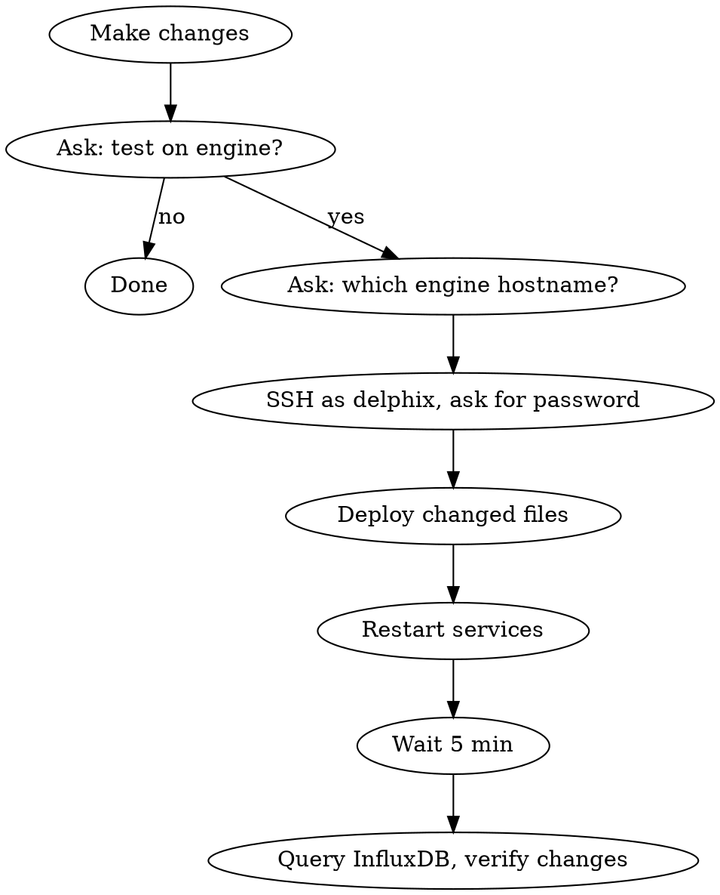

# Performance Diagnostics Deploy & Verify

## Overview

Workflow for making config changes to the performance-diagnostics repo, deploying them to a Delphix test engine over SSH, and verifying the changes are working correctly via InfluxDB queries.

## Workflow



## Step 1 — Make Changes

Make the requested code/config changes. Summarise what was changed and why before asking about testing.

## Step 2 — Ask to Test

```
Changes done. Do you want to test these on a Delphix engine?
```

If no → stop. If yes → proceed.

## Step 3 — Get Engine + Password

```
Which Delphix engine hostname should I deploy to?
```

Then SSH using `sshpass`:
```bash
sshpass -p "$PASSWORD" ssh -o StrictHostKeyChecking=no delphix@$HOST "..."
```

Ask for the SSH password if not already known. Default user is always `delphix`.

## Step 4 — Deploy Changed Files

**File locations on engine:**

| Repo path | Engine path |
|---|---|
| `telegraf/telegraf.base` | `/etc/telegraf/telegraf.base` |
| `telegraf/telegraf.inputs.*` | `/etc/telegraf/telegraf.inputs.*` |
| `telegraf/connstat-stats.sh` | `/etc/telegraf/connstat-stats.sh` |
| `telegraf/nfs-threads.sh` | `/etc/telegraf/nfs-threads.sh` |
| `telegraf/zcache-stats.sh` | `/etc/telegraf/zcache-stats.sh` |
| `telegraf/zpool-iostat-o.sh` | `/etc/telegraf/zpool-iostat-o.sh` |
| `telegraf/delphix-telegraf-service` | `/usr/bin/delphix-telegraf-service` |
| `telegraf/perf_playbook` | `/usr/bin/perf_playbook` |
| `telegraf/delphix-telegraf.service` | `/lib/systemd/system/delphix-telegraf.service` |
| `influxdb/delphix-influxdb-init` | `/usr/bin/delphix-influxdb-init` |
| `influxdb/delphix-influxdb-service` | `/usr/bin/delphix-influxdb-service` |
| `influxdb/perf_influxdb` | `/usr/bin/perf_influxdb` |
| `influxdb/influxdb.toml` | `/etc/influxdb/influxdb.toml` |
| `influxdb/influxdb-init.conf` | `/etc/influxdb/influxdb-init.conf` |
| `influxdb/delphix-influxdb.service` | `/lib/systemd/system/delphix-influxdb.service` |
| `influxdb/influxdb-nginx.conf` | `/opt/delphix/server/etc/nginx/conf.d/influxdb.conf` |

Only copy files that were actually changed. Use `scp` to `/tmp/` first, then `sudo cp` to destination. Set `chmod +x` on any shell scripts.

**InfluxDB data directory:** `/var/lib/influxdb/engine`

## Step 5 — Restart Services

```bash
sudo systemctl restart delphix-influxdb
sleep 5
sudo systemctl restart delphix-telegraf

# Confirm both are active
systemctl is-active delphix-influxdb
systemctl is-active delphix-telegraf
```

## Step 6 — Wait 5 Minutes

Wait for data to flow into InfluxDB. Use `ScheduleWakeup` with `delaySeconds: 270` (within cache window).

## Step 7 — Verify via InfluxDB Query

Get the InfluxDB credentials from the engine:
```bash
sudo cat /etc/influxdb/influxdb_meta
```

Query InfluxDB using the Flux API to verify the changes for the **last 5 minutes** of data. Tailor the query to what was changed:

| Change type | What to verify |
|---|---|
| New measurement added | `from(bucket:"default") |> range(start: -5m) |> filter(fn: (r) => r._measurement == "new_measurement") |> count()` |
| Field removed (e.g. `wwid` tag) | Check tag keys don't include the removed tag |
| Histogram processors | Verify `hist_estat_*` measurements exist with bucket fields |
| `microseconds` field | Check field exists in relevant measurements |
| `connstat` aggregation | Verify `tcp_stats` has `service` and `connections` fields |

Query via curl:
```bash
curl -s -X POST "http://localhost:8086/api/v2/query?org=delphix" \
  -H "Authorization: Token $INFLUXDB_READ_TOKEN" \
  -H "Content-Type: application/vnd.flux" \
  -d 'from(bucket:"default") |> range(start: -5m) |> filter(fn:(r) => r._measurement == "MEASUREMENT") |> limit(n:5)'
```

Report results clearly: what measurements exist, what fields/tags are present, and whether the change is confirmed working.

Then ask:

```
Verification done. Do you want to commit these changes?
```

If no → stop. If yes → proceed to Step 8.

## Step 8 — Commit Changes

Show the latest commit:
```bash
git log -1 --oneline
```

Ask:
```
Latest commit: "<hash> <message>"
Do you want to (1) amend that commit or (2) create a new commit?
```

**If amend:**
```bash
git add -A
git commit --amend --no-edit
```

**If new commit:**
Ask:
```
What should the commit message be? (include the Jira ID, e.g. "DLPX-12345 Fix xyz")
```

Then:
```bash
git add -A
git commit -m "<message from user>"
```

Then ask:
```
Commit done. Do you want to push and update/raise a PR?
```

If no → stop. If yes → proceed to Step 9.

## Step 9 — Push and PR

`git review` is a Delphix tool that pushes the branch and creates/updates the PR in one command. Use it instead of `git push` + `gh pr create`.

First check for an existing open PR on the current branch:
```bash
gh pr list --head "$(git branch --show-current)" --state open
```

**If PR exists → update it:**

```bash
git review -r <PR_number>
```

Then fetch the current PR description and update it to reflect the new changes:
```bash
gh pr view <number> --json body
gh pr edit <number> --body "..."
```
Keep the existing structure but add/update the relevant sections.

**If no PR exists → raise a new one:**

Ask:
```
What is the Jira ticket number for this PR? (e.g. DLPX-12345)
```

Fetch the Jira issue using the Jira MCP tool (`mcp__jira__jira_get_issue`) to understand the problem context. Then run:

```bash
git review
```

This creates the PR as a draft. Get the PR URL from the output, then set a full description:

```bash
gh pr edit <number> --title "<JIRA>: <short title>" --body "$(cat <<'EOF'
## Summary
- <bullet points describing what changed and why>

## Problem
<derived from Jira issue description>

## Solution
<what was implemented>

## Testing
- [ ] Deployed to test engine
- [ ] InfluxDB queries confirmed data flowing correctly
- [ ] <other relevant checks>

Jira: <JIRA_URL>
EOF
)"
```

Return the PR URL to the user.

## Common Mistakes

- Forgetting `chmod +x` on shell scripts → Telegraf fails with `EXEC` error
- Restarting Telegraf before InfluxDB is ready → Telegraf starts with `[[outputs.discard]]`
- Querying before 5 minutes pass → no data in range, looks broken but isn't
- Copying the wrong file path (influxdb vs telegraf directories)
